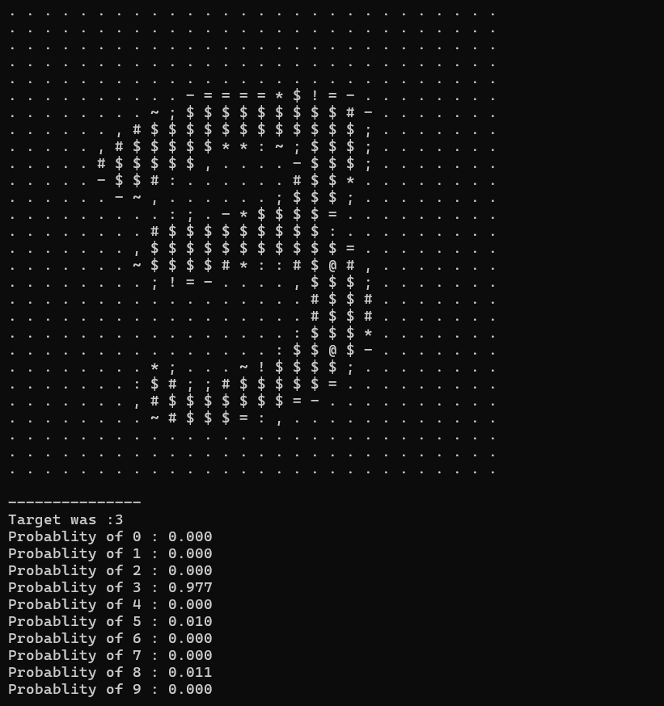

In this project, I developed a flexible neural network in C, allowing users to customize the number of hidden layers and the number of neurons in each layer. The implementation supports three optimization techniques: Adam, Gradient Descent (GD), and Stochastic Gradient Descent (SGD)

For detailed explanation please read the 'rapor.pdf'.

\
Examples:

