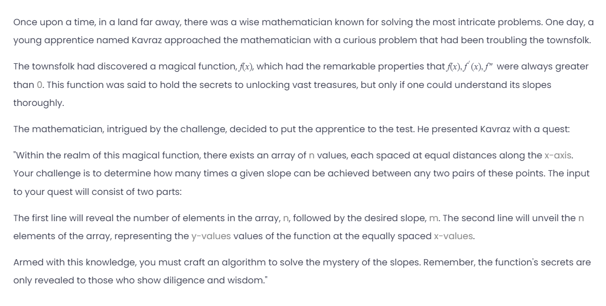
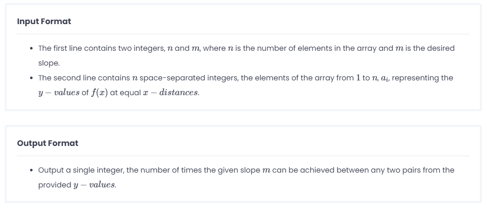
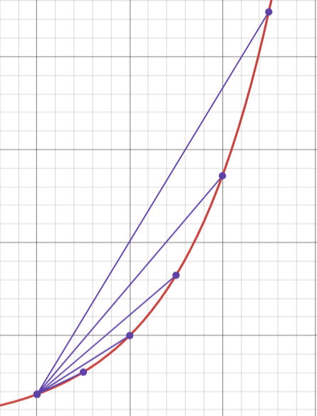
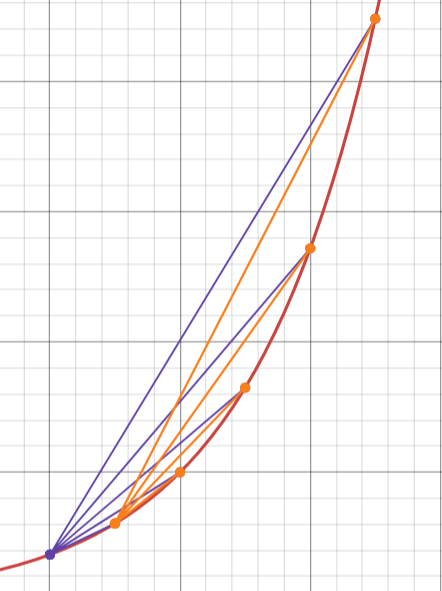
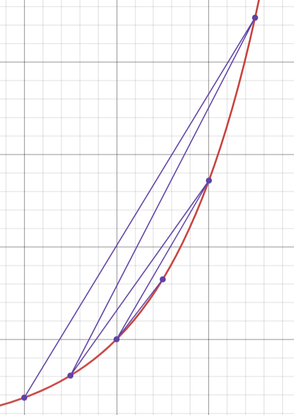

# TheMathematician Sorusu - Algoleague

---

## Soru


----

Bir fonksiyon f(x) ile ilgili bilgiler verilmektedir: __f(x), f'(x) ve f''(x)__ değerleri her zaman pozitif olacak şekilde. İki farklı x değeri seçerek oluşturduğumuz herhangi bir doğru segmentinin eğimi, belirli bir değerle eşit olma durumunu inceliyoruz. Bu koşullar altında, seçilen iki nokta arasındaki doğru segmentinin eğimi, verilen hedef eğime kaç farklı şekilde eşit olabilir?


>4 5
1 4 9 16

Birinci satırda ilk sayı kaç nokta olduğunu ,ikinci sayı ise istenen eğimi gösteriyor. İkinci satır ise fonksiyonun y değerlerini gösteriyor.

m = 5
| x | y |
| ---- | --- |
| 1 | 1 |
| 2 | 4 |
| 3 | 9 |
| 4 | 16 |


Örneğin cevabı 2.
1. **(1,4)** ikilisi : (16-1)/(4-1) = 5 
1. **(2,3)** ikilisi : (9-4)/(3-2) = 5

----

#### Deneme 1

Soruyu görünce aklımıza ilk olarak her ikili noktayı degerlendirip eğimi __m__ e eşit olanları saymak gelmiş olabilir. Ama bu yöntem süre kısıtlamasından dolayı testi geçemiyor.

Girdileri alma:
```python
n,slope = map(int,(input().split()))

liste1 = list(map(int,(input().split())))
```
---
```python
count = 0
l=0    #Sol nokta
while l < n:
    r = l+1 #Sag nokta
    while r<n:
        tempSlope = (liste1[r]-liste1[l])/(r-l)
        if tempSlope==slope:
            count += 1
        r += 1
    l += 1
}
```

- Bu yöntemi biraz optimize etmeye çalışalım. 

Baştan başlayarak kendisinden sonraki noktaları birleştirerek oluşan eğimleri degerlendirelim ve elimizdeki eğim istenen eğimi geçerse sonraki noktaya geçelim.



-----


```python
elif tempSlope > slope:
    break
```

Hala yeterince optimize değil. Kodu optimize yapmak için ekleyebilecieğimiz bir şey daha var.

- Dış döngüde elimizdeki ardışık iki nokta istenen eğimden büyükse kontrol işlemini bırakabiliriz

Fonksiyonun türevi ve ikinci türevi pozitif olduğu için bunu diyebiliriz.
```python
if (liste1[l+1]-liste1[l])/1> slope:
    break
```
Kod hala süre aşımına uğruyor.

* Ne yazık tüm bu yaptıklarımıza rağmen süre sınırına taklıyoruz. Başka bir yöntem denemeliyiz.

------

#### Deneme 2

**Two Pointer** olarak bilinen bir yöntem var onu bu soruya uygulamaya çalışalım ve sonuç veriyor mu bakalım.

İlk olarak en sol ve en sağ noktaları belirleyelim.

```python
#input alma
n,slope = map(int,(input().split()))
liste1 = list(map(int,(input().split())))

l=0    #En sol nokta
r=n-1  #En sağ nokta
```

Amacımız bu iki noktayı uygun şekilde hareket ettirerek istenen eğime ulaşmak.




##### İzlememiz gereken adımlar:

1 -  Elimizdeki eğim istenen eğimin değerinden küçükse **sol noktayı** bir birim **sağa** kaydır. (Eğim arttı)

2 - Elimizdeki eğim istenen eğimden büyükse **sağ noktayı** bir birim **sola** kaydır. (Eğim azaldı)

3 - Eğim eşitse **sayacı arttır** ve denge durumunu bozmak için sol tarafı bir birim sağa(ya da sağı sola) kaydır.


```python
count=0
while l<r:
    tempSlope = (liste1[r]-liste1[l])/(r-l)
    if tempSlope < slope:
        l=l+1
    elif tempSlope > slope:
        r=r-1
    else:
        count+=1
        l=l+1
print(count)
```

Yukarı da python ile yazılan kodda nasıl implemente edileceğini görebiliriz. Sayacı artırarak sonucu buluyoruz ve son olarak yazdırıyoruz. Bu kodu test ettiğimizde ise  başarılı bir şekilde geçebiliyoruz.
